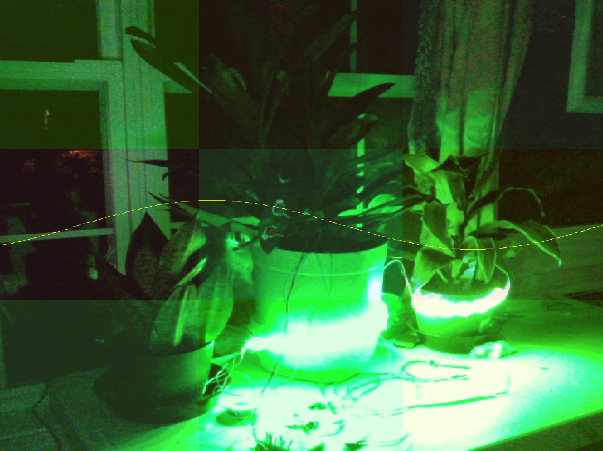
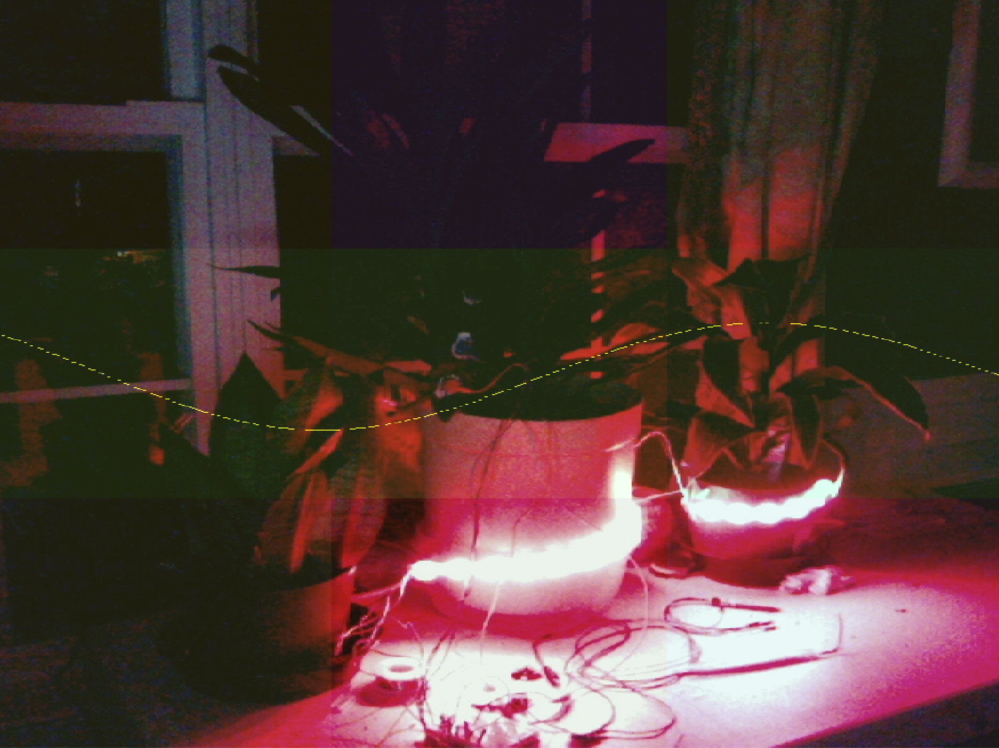
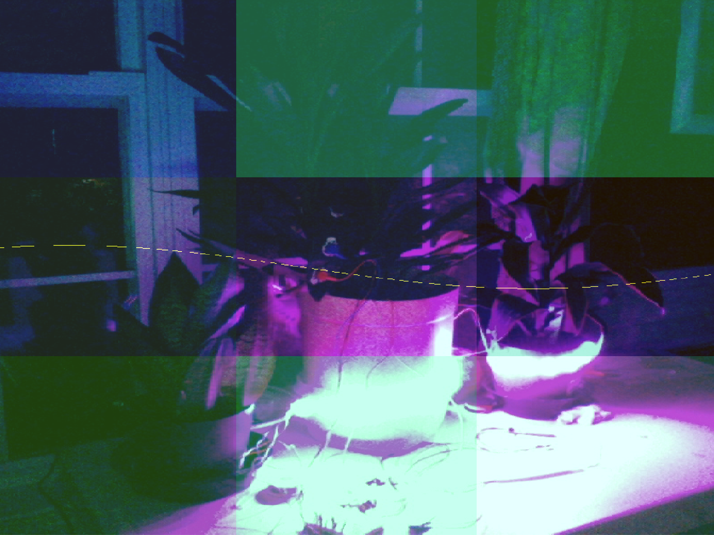

# InvisibleIntentions
Granting Sonic Agency to Plants

## Tangible Bits

For the physical aspect of this project, I've got some lovely plants. I'm using an Arduino UNO, the Adafruit STEMMA moisture sensor, Sparkfun Electrode Pads, and a DIY Moisture sensor from some nails I pulled out of the floorboards. All the sensors are housed happily in the soil of the flower pots or adhered directly to the leaves of the plants. I'm also using a NeoPixel Strip which is wrapped around the flower pots. Below are some links to these wonderful products. 

https://store.arduino.cc/usa/arduino-uno-rev3

https://www.adafruit.com/product/4026

https://www.sparkfun.com/products/12970

https://www.adafruit.com/product/1138?length=2

https://images.homedepot-static.com/productImages/07f25cc5-c120-4161-9b93-58d3e89a6e97/svn/grip-rite-roofing-nails-212egrfg1-64_1000.jpg

## Arduino Code

The arduino code is pretty barebones. It's just reading data from the sensors and shipping that off into the serial port. It also recieves data from the serial port and sends that out as RGB values for the NeoPixel strip. One thing to keep in mind is that Max sends lists as individual messages (or at least how I was sending them). So, in the Arduino code it loops the recieve until it's got 3 values to be used as RGB for the strip.

## Max Patch

Max is where things get hairy. First, we recieve the serial messages from the Arduino. We then map them to more human-audible frequencies. These frequencies are stored in an OSCbank, which is being moved along and cleared out by a slow phasor. This will (hopefully) create some slow, ambient changes over time. The generated sound is then graphed using a jit.catch object. 

There is also live webcam footage that is jit.grab'd and the jit.catch is operated on top of it.

Finally, the Twitch Bot is housed in a Node server within Max. When a user sends a change color message with 3 RGB values, that data will be collected in Max and sent back to the Arduino where it will change the RGB strip.

## Twitch Bot

The Twitch Bot code heavily relies on the examples from the twitch documentation for this so that'd be a much better place to look for all of the features (link below). My only changes were adapting it for use in Node for Max. For this make sure to `require("max-api")`. I also added my information to the !info command and wrote a function for collecting the color values sent by a user and sending that to max through `maxApi.outlet(colorVals)`.

https://dev.twitch.tv/docs/irc

### Final Words

Thanks for peeping through this documentation, let me know if you've got any questions, comments, or concerns. You can email me: lucas@lucwhite.com

